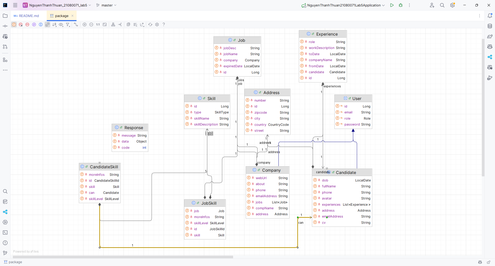
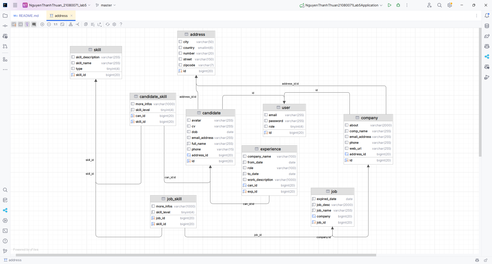

# Lab Week 05 - Websit tuyển dụng 

----

# Tác giả
- **Họ và tên**: Nguyễn Thanh Thuận
- **Mã số sinh viên**: 21080071
- **Lớp**: DHKTPM17B
# Giảng viên hướng dẫn
- **Họ Và Tên**: Võ Văn Hải

----
# Yêu cầu lab5
Cho csdl như hình. Hãy tạo một ứng dụng web sử dụng spring boot rồi thực hiện các công việc sau

1. Tạo các enities sao cho khi thực thi sẽ tạo ra các bảng như hình 
2. Viết các repositories interface 
3. Viết các lớp services 
4. Tạo các trang web cho phép công ty đăng tin tuyển người với các skill mong muốn 
5. Các ứng viên khi log vào sẽ được gợi ý các công việc có skill phù hợp với mình 
6. Giúp các công ty tìm các ứng viên có skill phù hợp rồi gửi mail mời. 
7. Đề xuất một số skill mà ứng viên chưa có để học. 
8. Và các yêu cầu khác

---
# Bài làm
## 1. Giới thiệu
Website tuyển dụng là một hệ thống hỗ trợ người tìm việc và nhà tuyển dụng kết nối với nhau. Ứng dụng cung cấp các chức năng như tìm kiếm việc làm, tạo hồ sơ ứng viên, đăng tin tuyển dụng, tìm kiếm ứng viên, gửi mail tuyển dụng trực tuyến, ..v.v.

## 2. Mô tả
Website tuyển dụng là một hệ thống giúp kết nối nhà tuyển dụng và ứng viên, giúp họ dễ dàng tìm kiếm công việc hoặc ứng viên phù hợp với yêu cầu của mình. Hệ thống sử dụng công nghệ Spring Boot để xây dựng và thực hiện các tính năng như sau:
1. **Đăng ký và đăng nhập cho người dùng:** Cung cấp cho các ứng viên và nhà tuyển dụng khả năng tạo tài khoản và đăng nhập để truy cập các chức năng của hệ thống.
2. **Quản lý thông tin của người dùng:** Người dùng có thể quản lý thông tin cá nhân của mình thông qua chức năng quản lý profile.
3. **Đăng tin tuyển dụng:** Nhà tuyển dụng có thể đăng tin tuyển dụng, bao gồm các yêu cầu công việc và kỹ năng cần thiết cho ứng viên.
4. **Gợi ý công việc:** Dựa trên các kỹ năng có trong hồ sơ của ứng viên, hệ thống sẽ gợi ý các công việc phù hợp.
5. **Tìm ứng viên phù hợp:** Nhà tuyển dụng có thể tìm kiếm ứng viên dựa trên kỹ năng và yêu cầu công việc. Hệ thống sẽ giúp tìm ra những ứng viên phù hợp nhất.
6. **Gửi email mời tuyển dụng:** Sau khi tìm được ứng viên phù hợp, nhà tuyển dụng có thể gửi email mời tham gia phỏng vấn hoặc làm việc.
7. **Xem CV của những ứng viên:** Nhà tuyển dụng cũng có thể xem qua CV của ứng viên nếu ứng viên đó có tải CV của họ lên hệ thống.

## 3. Yêu cầu
Đảm bảo các yêu cầu sau:
- **Phần mềm chạy code:** IntellIj IDEA(khuyến khích dùng nhưng bạn vẫn có thể dùng các phần mềm khác tương tự)
- **Cấu hình:**
  + Java Development Kit (JDK)
  + Gradle
  + MariaDB(Phần mền hỗ trợ có thể dùng HeidiSQL)
## 4. Công nghệ sử dụng
- **Spring Boot:** Spring Boot là một framework mạnh mẽ được phát triển bởi Pivotal (nay là VMware) nhằm đơn giản hóa việc phát triển ứng dụng Java. Nó giúp giảm thiểu cấu hình cần thiết và hỗ trợ nhanh chóng việc phát triển ứng dụng web và microservices
- **MariaDB:** MariaDB là một hệ quản trị cơ sở dữ liệu mã nguồn mở, được phát triển từ MySQL, với các tính năng và khả năng mở rộng tốt hơn. MariaDB cung cấp một số ưu điểm vượt trội như hiệu suất cao, tính ổn định và hỗ trợ mở rộng cơ sở dữ liệu, đặc biệt là trong các ứng dụng web.
## 5. Cài đặt
1. **Clone dự án từ GitHub**
   ```bash
   git clone https://github.com/MrNguyen202/www_lab_week_05_NguyenThanhThuan_21080071.git
   ```
2. **Mở ứng dụng:** 
- Sử dụng IntellIj IDEA để mở project code vừa clone.
- Chạy ừng dụng bằng class **"NguyenThanhThuan21080071Lab5Application"** để tạo database
- Class diagram của project:

- Cơ sở dữ liệu đã cập nhật thêm:

3. **Tạo dữ liệu:**
- Chạy file script "data.sql" có trong project hoặc đoạn script đính kèm sau:
[Uploading data.sql…]()
## 6. Demo và hướng dẫn sử dụng
1. **Đăng nhập**
- Với quyền account là **ứng viên**:
  + **Email**: caterina.mcclure@hotmail.com
  + **Password**: 16y27p983hp96r <br>
   <br> <br>
  + Sau khi đăng nhập, ứng viên sẽ được gợi ý các công việc phù hợp với kỹ năng của mình. <br>
  
- Với quyền account là **nhà tuyển dụng**:
  + **Email**: mitchell.pagac@hotmail.com
  + **Password**: 155zvczy <br>
   <br> <br>
  + Sau khi đăng nhập, nhà tuyển dụng sẽ được gợi ý các ứng viên tiềm năng theo Level. <br>
   <br> <br>
2. **Chức năng quản lý thông tin người dùng** <br>
- Có thể cập nhật thông tin cá nhân sau đó nhấn nút "Save Changes" để lưu thông tin. <br> 

3. **Chức năng đăng tin tuyển dụng**
- Người dùng có thể đăng tin tuyển dụng bằng cách điền thông tin vào form sau đó nhấn nút "Đăng tin". <br>

4. **Chức năng thêm kỹ năng**
- Người dùng có thể thêm kỹ năng mới để đưa vào phần những kỹ năng của tin công việc. <br>

5. **Chức năng quản lý tin tuyển dụng**
- Nhà tuyển dụng có thể xem danh sách các tin tuyển dụng đã đăng và xóa tin tuyển dụng. <br>

6. **Chức năng tìm kiếm ứng viên phù hợp với skill của công việc**
- Người dùng có thể tìm kiếm ứng viên phù hợp với skill của công việc bằng cách nhấn nút "Tìm ứng viên" tại công việc mình muốn từ màn hình phía trên <br>

7. **Chức năng gửi mail cho ứng viên đã chọn(có thể gửi đồng loạt)**
- Sau khi tiến hành tìm kiếm ứng viên, danh sách ứng viên sẽ hiển thị. Nhà tuyển dụng có thể gửi mail cho họ bằng cách nhấn vào biểu tượng email hoặc có thể gửi đồng loại bằng cách nhấn vào "mail" để gửi đồng loạt bằng họp thử Send Mail<br>

- Và đây là mail được gửi đến 

8. **Chức năng xem CV ứng viên**
- Nhà tuyển dụng có thể xem CV của ứng viên bằng cách nhấn vào nút "View" ở bất cứ trang cần xem thông tin ứng viên. <br>
- Và được kết quả như sau:
   

## 7. Phát triển thêm sau lab
- Chức năng tìm kiếm công việc
- Chức năng gợi ý kỹ năng cần học
- Chức năng tạo hồ sơ ứng viên(upload CV)
- Nâng cao bảo mật bằng Spring Sercurity
- Chức năng chat trực tuyến giữa nhà tuyển dụng và ứng viên
- Dự báo xu hướng phát triển công việc, các skill, ..v.v
- AI support

## 8. Kết luận
Trên đây là hướng dẫn cài đặt và sử dụng ứng dụng website tuyển dụng. Ứng dụng giúp kết nối nhà tuyển dụng và ứng viên một cách dễ dàng và nhanh chóng. Hy vọng rằng thông qua bài lab này, bạn sẽ có thêm kiến thức và kỹ năng trong việc xây dựng ứng dụng web sử dụng Spring Boot. Cảm ơn bạn đã theo dõi bài lab này!

# Tài liệu tham khảo
- Slide bài giảng của giảng viên
- Spring Boot - https://docs.spring.io/
- Youtube - https://www.youtube.com/
- Google - https://www.google.com/
- ChatGPT - https://chat.openai.com/
# Đóng góp
- Mọi đóng góp, góp ý của bạn đều giúp tôi hoàn thiện hơn. Hãy để lại bình luận hoặc liên hệ với tôi qua email: nguyenthuan020010@gmail.com
- Hoặc tạo issues tại:
    + Repository: [lab_week_05_NguyenThanhThuan_21080071](https://github.com/ngocmai1522k2/www_lab_week5.git)
    + Issues: [Issues](https://github.com/MrNguyen202/www_lab_week_05_NguyenThanhThuan_21080071/issues/new)
- Rất mong nhận được sự đóng góp tích cực từ bạn đọc. Xin cảm ơn!
